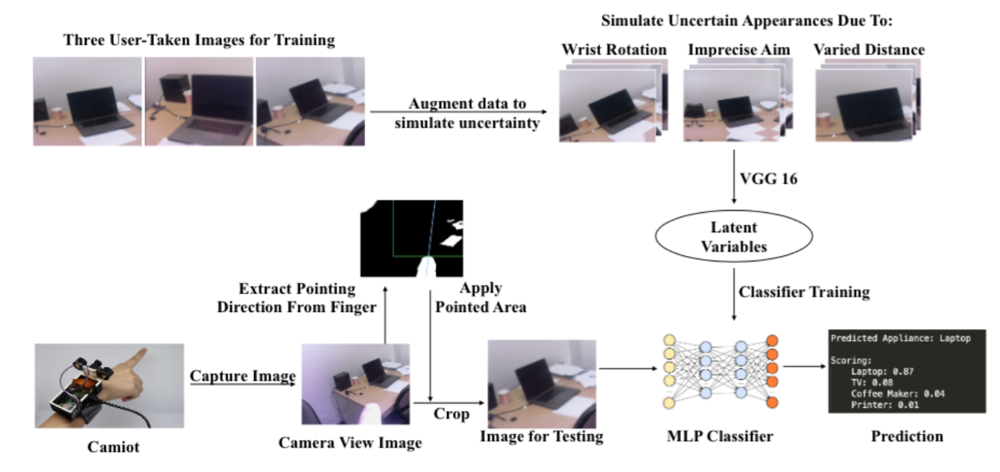

# camiot

## Camiot: Interacting with an Internet of Things from a Distance Usinga Wrist-Worn Camera
***

### Project Description:

With an Internet of Things (IoT) spatially distributed in our environment, users often feel a need to interact with themremotely. We summarize a design space of remote interaction with objects in the environment and identify an underexploredarea that inspires the design of Camiot—a wrist-worn camera that provides an always-available, self-contained solutionto point at, recognize and interact with IoT objects at a distance. We collected a real-world dataset that reveals how IoTobjects are distributed in the environment and the uncertainty of their appearance in the camera image due to varyingdistances, imprecise aim and inadvertent wrist rotation. Based on these insights we develop(i)a series of data augmentationtechniques to address the uncertainty problem and;(ii)a disambiguation mechanism leveraging a user’s finger occlusion asindicator of where the target appliance is located in the image. We employ these two image processing methods to enhance theperformance of existing object recognition models, resulting in a 28% improvement when trained and tested at a per-user basis.A user study demonstrates Camiot in action where we observed how participants complemented pointing with disambiguationgestures to overwrite the system when it misidentified the intended IoT object

***

### "code folder" explanation:
1.  Network folder:  Includes the code for server and client codes for esp8266(server) and raspberry pi(client) 
2. BurstShooting: Includes the code for taking multiple pictures in the given time. The data from burstShooting would be used for training the ML model.
3. touchSensor: This folder has the code for configuring the OSEPP touch sensor and reading the data. 
4. imageProcessing: The code for training the ML and processing the Images
5. finalCode: Combining the different code pieces here. 

***
---

